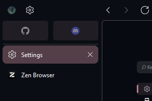

# Ayu

Ayu Colorscheme for Zen Browser

Find the profile-root by visiting about:profiles

In your browser profile-root/chrome/zen-themes directory, create a new folder containing the colorscheme css.

In the profile-root/zen-themes.json file, add a fake entry for this colorscheme, by duplicating any other zen-mod and changing the name and folder.

In the profile-root/chrome/zen-themes.css file, duplicate any of the import statements and add in the path for the colorscheme css, also change the comments 

